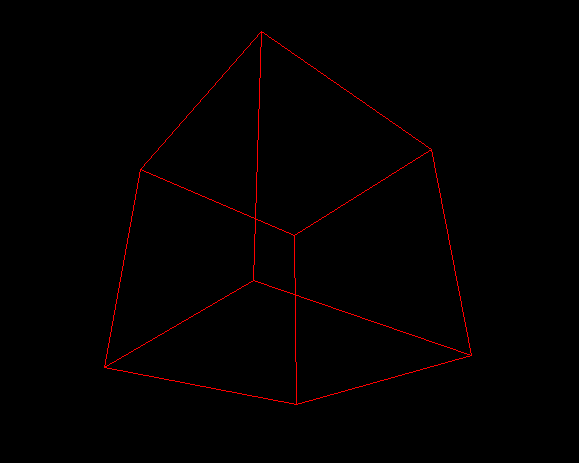

# Project 3D objects with a 2D engine



Use ↑ ↓ → ← keyboard arrows to rotate the cube

Fun project I did in a couple hours to test this formula
```
x' = x/z
y' = y/z
```
which projects a 3D object on a 2D screen.

I also use this formula
```
x' = x cos θ − y sin θ
y' = x sin θ + y cos θ
```
to rotate vectors in the space.


Modify these lines to change vertices positions:
```C
   struct cube cube = {
      .vertices = {
         // x,y,z
         {-0.3, 0.3, 1},
         {0.3, 0.3, 1},
         {-0.3, -0.3, 1},
         {0.3, -0.3, 1},
         {-0.3, 0.3, 1.6},
         {0.3, 0.3, 1.6},
         {-0.3, -0.3, 1.6},
         {0.3, -0.3, 1.6},
      },
      .num_vertices = NUM_VERTICES,
   };
```

# Dependency
The only dependency is SDL2 for it's 2D engine.

**Only tested on Linux and WSL**

# Features
I will not add features as it was just for fun and I wanted to code in C, not SDL.
More features would mainly come from SDL and that is not my goal here.

# License

MIT License